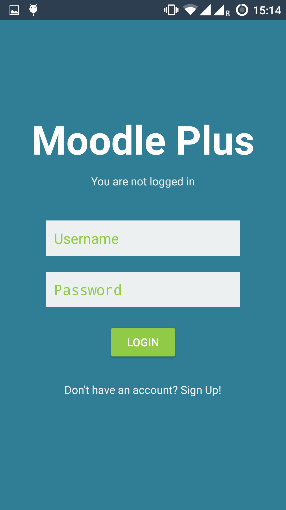
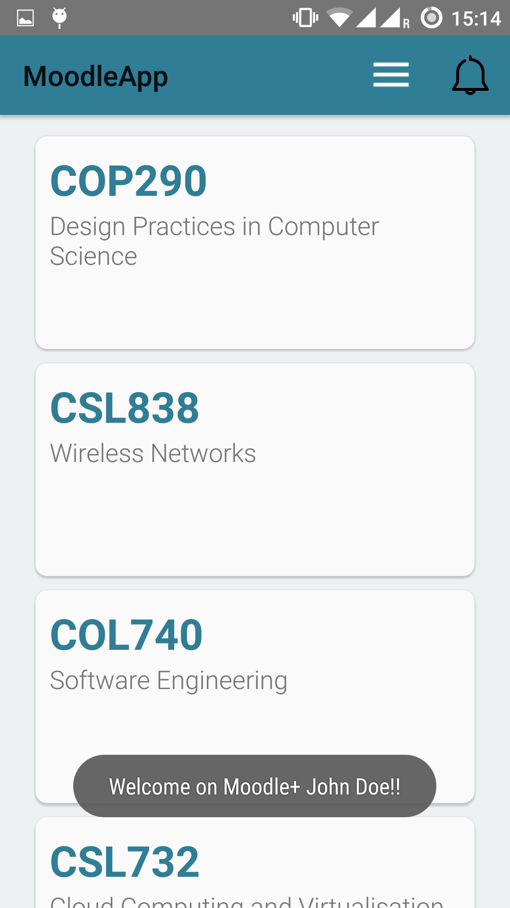
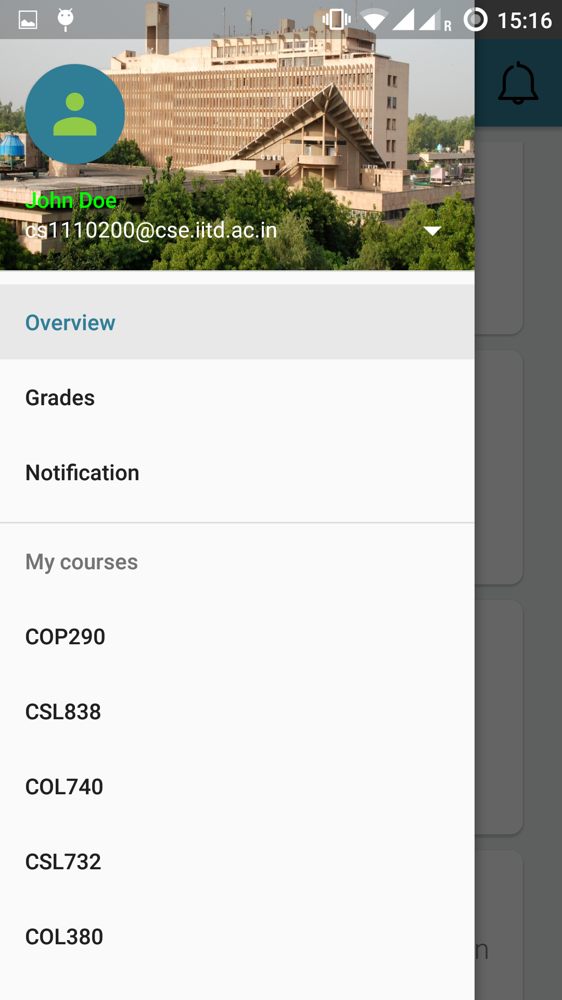
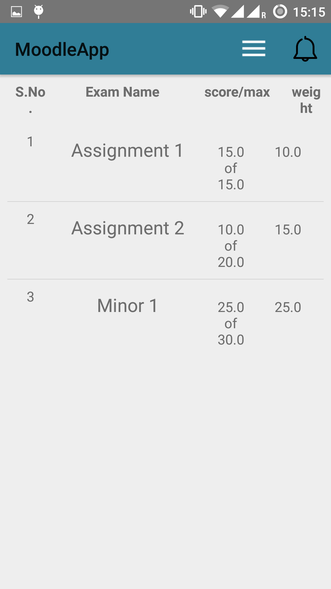
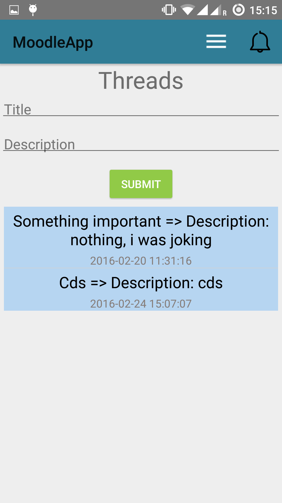

# Moodle App 

This app allow student to view all grades course list,uploading assignments and course discussion room.

[Doc.pdf](doc/assignment-1-moodle.pdf)

---

## Screenshots

  <table>
    <tr>
     <td></td>
     <td></td>
     <td></td>
    <tr> 
      <td></td>
      <td></td>
      <td></td>
    </tr>
  </table>
  
---

## Detail of Each activity or fragments
* **MainActivity:** This is the main login screen that the user uses to enter his username and password. Also if the user doesn’t have an account he is taken to the Signup ac- tivity. when the user clicks on the submit button his details are sent in a string request,the cookies are stored and the response is sent to the next activity that is the main2activity.java
* **Main2Activity:** This is the base activity for all the various fragments in the app and all the transcations are handled in this activity all buttons in this are linked to a request whose response is sent to the next fragment and the transaction is added to the backstack.This activity also holds the navigation drawer and the toolbar which all fragments share.
* **MainActivityFragment:** This fragmetn contains the recycler view which holds the cards of each course and onClick listener for each of the course, which sends him to the CourseFragment.
* **CourseFragment:** this contains the menu for each of the courses. As soon as the fragment is created the data sent by previous fragment is extracted ad then requests for each of the buttons here are created. When any of the listeners notice a click then the particular course information and the selected option specific data is combined into one url and the response of the stringrequest is sent to the next fragment on a successful request
* **OverviewFragment, AssignmentFragment, GradesFragment, NotificationFragment :** All these fragments implement fragments which contain a list views and display the response from previous fragment after performing various formatting on them. So each of these have their own extensions of the arrayadapter to display the data received in the best possible way.
* **ResourcesFragment:** This fragment also essentially belongs to the same class of above fragments because this is also an endpoint in the application. Here the user can choose, by clicking the add file button any resource from their mobile directory.

## References and Resources used
* We used the material design library by Google for various UI elements like the recycler view.
* We also used MikePenz’s material drawer library for the navigation drawer.
* To read about how to implement various elements, we used websites like Vogella, Developer.android.com and extensively used StackOverFlow.
